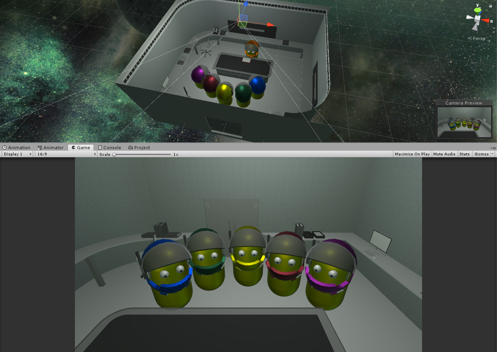
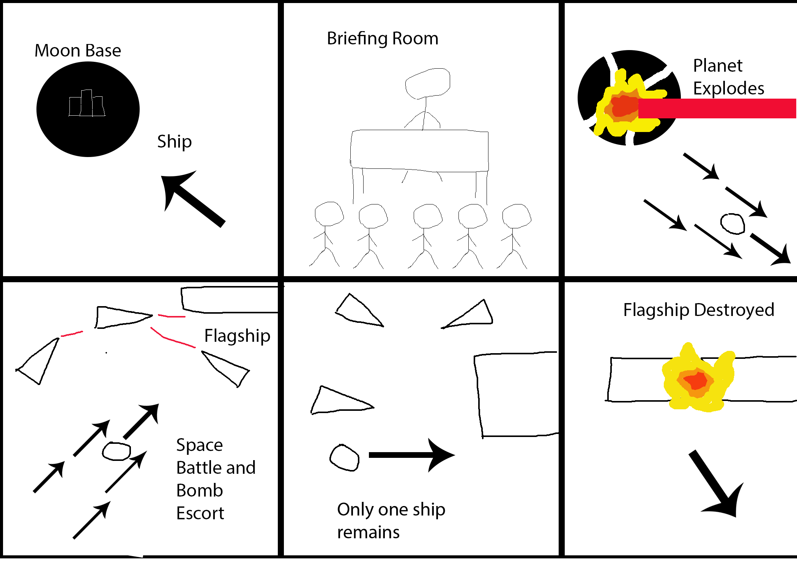

# Game-Engines-Assignment-1
This assignment will aim to create a sci-fi machinima of a spacebattle along with other story elements, which are not based off one piece of work but instead loosely inspired from multiple sci-fi scenes. 

## The Story
The story will first begin with a spaceship heading to Moonbase Alpha, which is the last post before Yortia, the homeworld of the Yortians. This will then cut to a briefing room where an elite squad of Yortians are being informed on their next, and probably last, mission: to destroy the ultimate weapon of the enemy, a flagship capable of destroying planets from afar. A screenshot of the scene below: 

After this brief, the five members of Squadra promptly leave the Moonbase on their ships, carrying the bomb needed to destroy the enemy flagship with them. As they are flying away however, the Moonbase is blown up in one fiery explosion. They continue to make their way to the enemy flagship and as they approach it, a large scale Space Battle between the final Yortian forces and the enemy ships has taken place around it. Squadra must weave through the battle and reach their quarry. All but one of them are destroyed but only one ship is needed to destroy the flagship. The Yortians will live to see another day. 

## The Goal
The ultimate goal of this project is to create an engaging, cinematic experience while remaining fully automonous. The first scene with use a simple seek behaviour for the approaching ship. The briefing scene will use voice-overs, Unity animations and IENumerators. 

The main technical features will be present in the space battle. The 5 Squadra members will use an offset pursue algorithm along with object avoidance to weave through the battle. The other ships will use pursue and evade algorithm to engage in dog fights. They will also fire at each other and when a ship's health reaches zero. There will initally be more ally ships but their numbers will quickly dwindle as they are taken out by superior fire power. When enemy ship's fuel reserves reach zero, they return to the flagship to refuel. As Squadra fly through the battle, AI cameras will be spawned to track them while also using preselected cameras at certain times for cinematic shots. 

## The Storyboard 

Video example of first storyboard slide:

